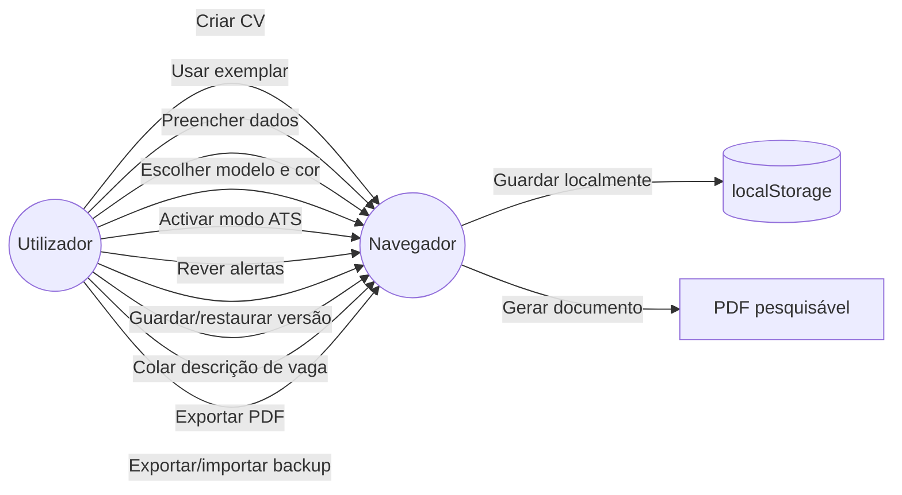

# CVRápido — documentação do projecto

**Versão:** 1.0  
**Data:** 24 de Setembro de 2026  
**Aplicação publicada:** https://fastcv-kohl.vercel.app/

## 1. Finalidade

O CVRápido é uma aplicação web para criar currículos profissionais em português, com foco em Angola e possibilidade de utilização internacional. O utilizador preenche um wizard, acompanha um preview em tempo real, escolhe um modelo e exporta um PDF com texto real.

O produto não promete aprovação automática por ATS. O modo ATS e a revisão local existem para melhorar a legibilidade, a consistência e a qualidade do conteúdo.

## 2. Funcionalidades actuais

- criação de CV vazio ou carregamento de CV exemplar;
- dados pessoais, resumo, experiência, formação, competências e idiomas;
- certificações, projectos e cursos complementares;
- modelos Europass, Clássico e Moderno;
- cores e controlo das secções visíveis;
- preview responsivo;
- PDF A4 pesquisável e seleccionável;
- modo ATS simplificado;
- revisão local de email, links, datas, resumo, competências e descrições;
- gravação automática no navegador;
- exportação/importação de backup JSON;
- versões nomeadas guardadas localmente;
- análise lexical de uma descrição de vaga;
- cópia de uma versão para uma candidatura específica;
- deploy automático através de GitHub e Vercel.

## 3. Manual de uso

### 3.1 Criar um CV

1. Abra a aplicação.
2. Seleccione **Criar meu CV agora**.
3. Preencha os dados pessoais.
4. Escreva o resumo profissional.
5. Adicione experiências e formação.
6. Registe competências, idiomas e secções complementares.
7. Avance até **Personalização**.

### 3.2 Usar o exemplar

Seleccione **Usar exemplo** para carregar dados fictícios de uma profissional de Luanda. Substitua todos os dados antes de exportar ou enviar o documento.

### 3.3 Personalizar

Na etapa de personalização:

- escolha Europass, Clássico ou Moderno;
- seleccione uma cor;
- active/desactive secções;
- active o **Modo ATS** quando a prioridade for simplicidade e leitura automática;
- leia a revisão antes de exportar.

### 3.4 Rever o CV

A revisão é local e apresenta alertas accionáveis. Verifica campos essenciais, formato do email, ligações, datas, quantidade de competências, resumo e descrições. Não atribui uma pontuação universal de ATS.

### 3.5 Guardar versões

Introduza um nome, por exemplo `Candidatura — Product Designer`, e seleccione **Guardar versão**. Clique no nome para restaurar uma versão ou use o ícone de remoção para a apagar.

### 3.6 Adaptar a uma vaga

1. Cole a descrição da vaga.
2. Seleccione **Analisar correspondência**.
3. Reveja os termos encontrados e ausentes.
4. Adicione apenas competências verdadeiras.
5. Guarde uma cópia para aquela candidatura.

A análise é lexical, local e transparente. Não altera o conteúdo automaticamente.

### 3.7 Backup

Use **Exportar backup JSON** para guardar dados e preferências. Use **Importar backup JSON** para restaurar um backup válido. O ficheiro deve ser guardado num local seguro porque contém dados pessoais.

### 3.8 Exportar

Seleccione **Exportar PDF**. O resultado é um PDF A4 com texto real. Em telemóveis, o preview é ocultado para dar prioridade ao formulário, mas a exportação mantém o formato A4.

## 4. Expectativas e limites

### O utilizador pode esperar

- funcionamento no navegador moderno;
- utilização sem conta;
- armazenamento local no dispositivo;
- exportação PDF pesquisável;
- adaptação visual por modelo;
- dados não enviados para um backend pelo fluxo actual;
- funcionamento em desktop e mobile.

### O utilizador não deve esperar

- sincronização entre dispositivos;
- recuperação de dados depois de limpar o navegador;
- pontuação ATS universal;
- correcção automática do conteúdo;
- validação factual das informações inseridas;
- exportação DOCX nesta versão;
- análise semântica avançada ou inteligência artificial externa.

## 5. Arquitectura técnica

```text
React 18 + TypeScript
        |
        +-- App.tsx
        |     +-- LandingPage
        |     +-- ResumeWizard
        |
        +-- ResumeContext
        |     +-- ResumeData
        |     +-- ResumeSettings
        |     +-- operações CRUD
        |
        +-- Forms
        |     +-- dados pessoais
        |     +-- experiência
        |     +-- formação
        |     +-- complementos
        |     +-- personalização
        |
        +-- Preview
        |     +-- ResumePreview
        |     +-- modelos e cores
        |
        +-- Utils
              +-- resumePdf (@react-pdf/renderer)
              +-- resumeReview
              +-- resumeStorage
              +-- resumeVersions
              +-- jobMatch
              +-- resumeDate
```

### Camadas

- **Apresentação:** componentes React e componentes UI Radix/Tailwind.
- **Estado:** `ResumeContext` centraliza CV, preferências e operações.
- **Domínio local:** `resumeReview`, `jobMatch`, `resumeStorage` e `resumeVersions`.
- **Renderização:** `ResumePreview` para ecrã e `ResumePdfDocument` para PDF.
- **Infraestrutura:** Vite para build, GitHub para versionamento e Vercel para deploy.

### Fluxo de dados

```text
Formulário
   -> operação do ResumeContext
   -> ResumeData / ResumeSettings
   -> preview actualizado
   -> localStorage
   -> PDF ou backup JSON
```

## 6. Diagrama de casos de uso



### Casos de uso principais

| Código | Caso de uso | Resultado |
|---|---|---|
| UC-01 | Criar CV vazio | Novo CV editável |
| UC-02 | Carregar exemplar | Dados demonstrativos carregados |
| UC-03 | Editar secções | Estado do CV actualizado |
| UC-04 | Personalizar modelo | Preview e PDF adaptados |
| UC-05 | Rever qualidade | Alertas locais apresentados |
| UC-06 | Analisar vaga | Termos encontrados/ausentes |
| UC-07 | Guardar versão | Cópia nomeada no dispositivo |
| UC-08 | Fazer backup | JSON exportado |
| UC-09 | Exportar PDF | Documento A4 pesquisável |

## 7. Estrutura de pastas

```text
src/
  app/
    App.tsx
    components/
      LandingPage.tsx
      ResumeWizard.tsx
      ResumePreview.tsx
      forms/
      ui/
    context/
      ResumeContext.tsx
    hooks/
      useResumeData.ts
    types/
      resume.ts
    utils/
      jobMatch.ts
      resumeDate.ts
      resumePdf.tsx
      resumeReview.ts
      resumeStorage.ts
      resumeVersions.ts
docs/
  documentacao-projecto.md
  plano-e-autoavaliacao.md
  pesquisa-curriculos-angola-internacional.md
  analise-comparativa-plataformas-cv-2026-09.md
```

## 8. Desenvolvimento local

Requisitos: Node.js 18+, npm e Git opcional.

```bash
npm install
npm run dev -- --host 0.0.0.0
npm run build
```

O build de produção é criado em `dist/`.

## 9. Qualidade e manutenção

Antes de cada alteração:

1. compreender o fluxo actual;
2. reutilizar tipos e operações existentes;
3. manter validações e acessibilidade;
4. testar desktop e mobile;
5. executar `npm run build`;
6. confirmar que exemplar, PDF e persistência continuam funcionais;
7. actualizar a documentação se o comportamento mudar.

## 10. Evolução futura

- exportação DOCX validada;
- importação de texto/PDF com revisão manual;
- versões sincronizadas entre dispositivos;
- contas e autenticação;
- backend apenas quando houver sincronização, IA protegida, pagamentos ou colaboração;
- testes automatizados de domínio e componentes;
- métricas de qualidade sem recolher dados pessoais por defeito.

